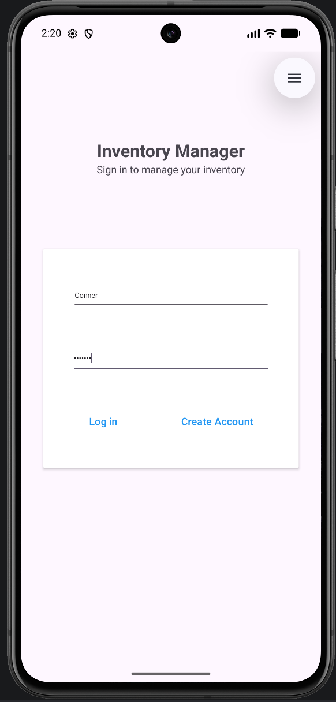
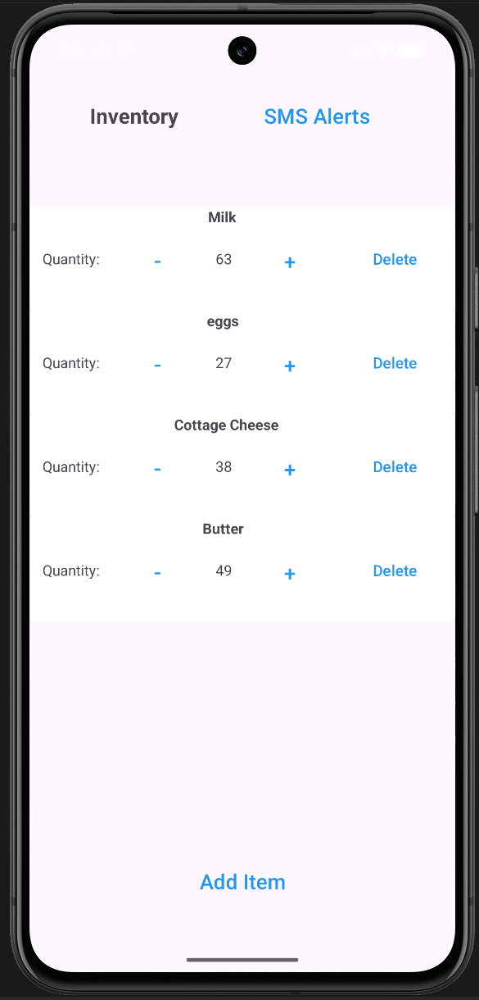
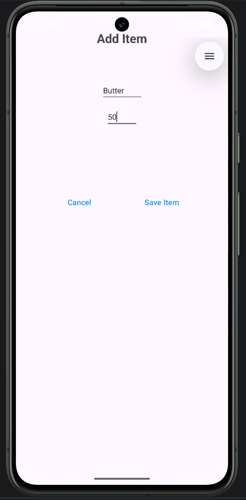

# Inventory Management App

A native Android inventory management application built with Java and SQLite. The app allows users to create an account, log in, manage inventory items, update item quantities, and remove items from their inventory.

This project was developed to gain experience building a native Android application with persistent database storage, user authentication, and CRUD functionality.

## Screenshots

### Login


### Inventory


### Add Item


## Features

- Create a user account
- User login and authentication
- Add inventory items
- View stored inventory
- Increase and decrease item quantities
- Delete inventory items
- Persistent SQLite database storage
- SMS permission integration for inventory alerts

## Technologies

- Java
- Android Studio
- SQLite
- Android SDK
- RecyclerView
- Git and GitHub

## Application Structure

The application is divided into several primary components:

- **Login Screen** - Allows users to log in or create an account.
- **Inventory Screen** - Displays stored inventory items and provides controls for managing item quantities.
- **Add Item Screen** - Allows users to add new items and quantities to the inventory.
- **Inventory Adapter** - Manages the display and interaction of inventory items using RecyclerView.
- **Database Helper** - Manages the SQLite database, including user accounts and inventory records.

## Data Management

The application uses SQLite for persistent local data storage. The database contains separate tables for user accounts and inventory items.

The application supports CRUD operations for inventory records:

- **Create** - Add new inventory items
- **Read** - Retrieve and display stored inventory
- **Update** - Increase or decrease item quantities
- **Delete** - Remove inventory items

User credentials are also stored locally in SQLite and are used to validate users during login.

## Running the Project

Clone the repository:

```bash
git clone https://github.com/Windex3/Inventory-Manager
```

Open the project in Android Studio.

Allow Gradle to synchronize the project dependencies, then run the application using an Android emulator or compatible Android device.

## Future Improvements

Possible future additions include:

- Cloud-based database storage and synchronization
- Multiple inventory lists
- Barcode scanning
- Inventory search and filtering
- Inventory reports and analytics
- Improved low-stock notifications
- Enhanced user authentication and security
